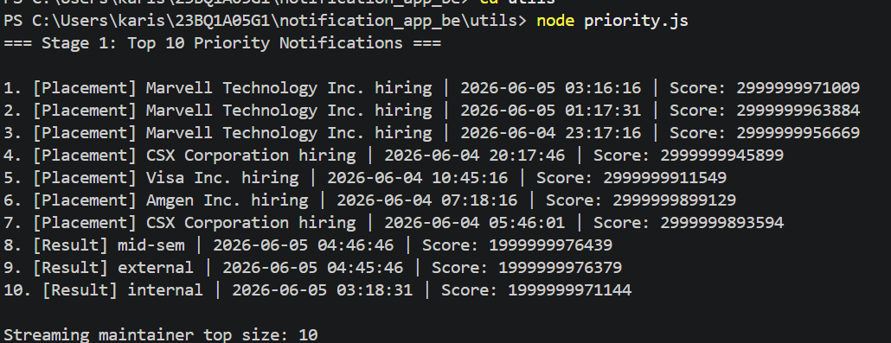

# Notification System Design – Stage 1

## Priority Inbox Algorithm

### Approach
The priority inbox displays the top **n** most important **unread** notifications. Importance is determined by:
1. **Weight** (category priority): Placement (3) > Result (2) > Event (1)
2. **Recency**: More recent notifications are preferred.

**Composite Score**:  
`Score = (weight × 1e12) - (seconds since timestamp)`  
This ensures weight dominates, while recency acts as a tie-breaker.

### Efficient Maintenance for Streaming Notifications
To handle a continuous stream of new notifications efficiently:
- Use a **min-heap** of size `n` (top-n candidates).
- For each new notification:
  - If heap size < n → push + heapify up (O(log n))
  - Else if new score > heap root → replace root + heapify down (O(log n))
- This yields **O(log n)** per insertion, avoiding full sorting.

### Implementation
- `computePriorityScore()` – calculates numeric priority.
- `getTopNNotifications()` – sorts full list (simple for static data).
- `PriorityInboxMaintainer` – heap-based class for streaming efficiency.

### Stage 1 Output Screenshot
*Screenshot showing terminal output of top 10 notifications fetched from the API. Included in repository as `stage1_output.png`.*

